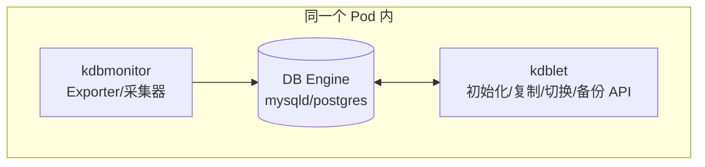
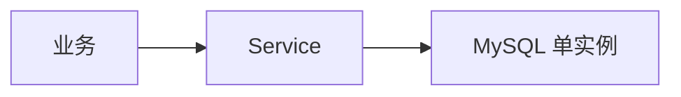
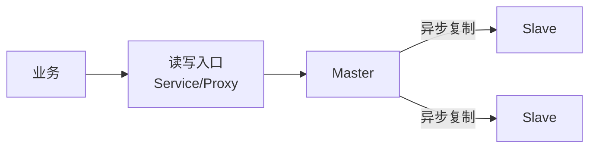
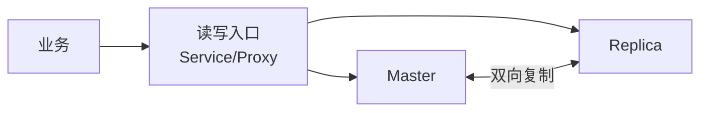
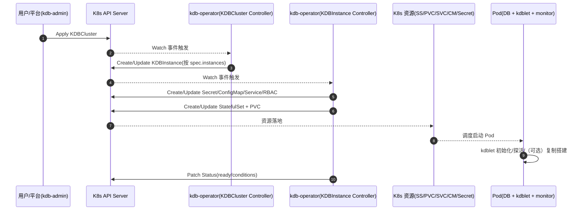
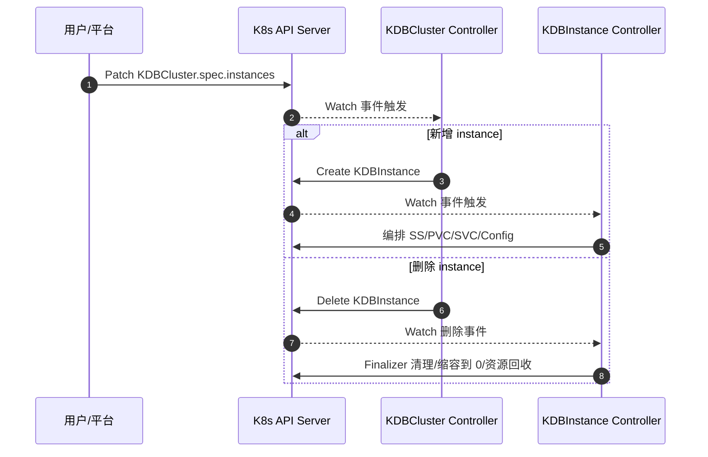
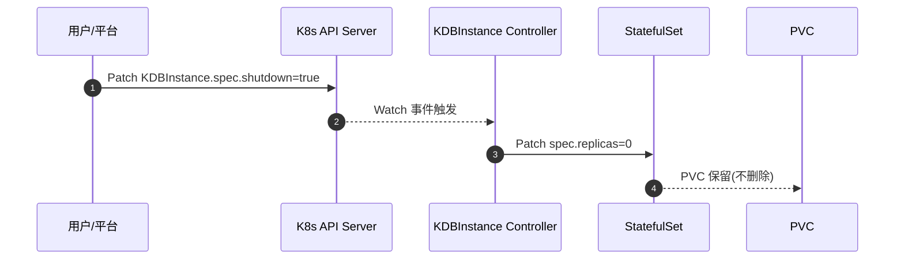
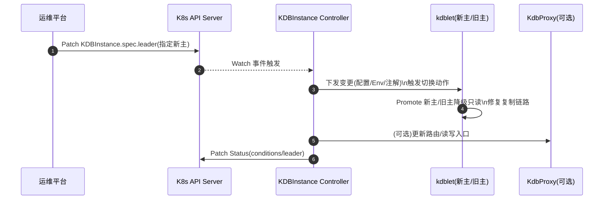
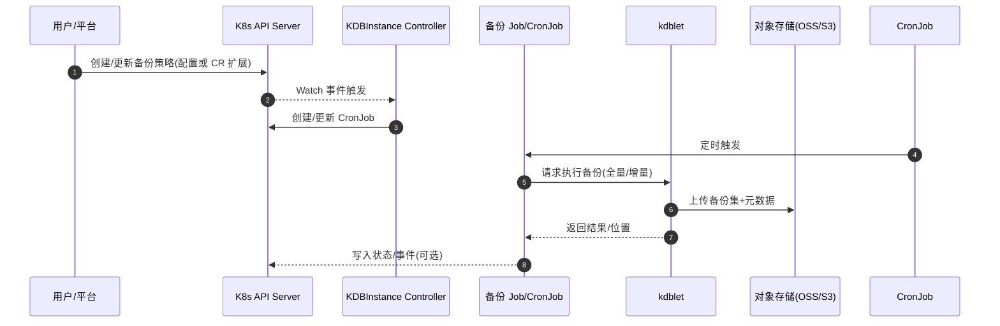

# kdb

## 介绍

`kdb` 是一套面向 Kubernetes 的云原生数据库敏捷解决方案：通过 **CRD + Operator** 管理数据库实例全生命周期，并通过 **Sidecar** 承载实例运行时动作（初始化、探活、复制搭建/切换、备份、指标采集等），从而在 K8s 内提供标准化、可声明式的数据库交付能力。

本仓库主要包含：
- `kdb-operator`：控制面（Controller），负责 K8s 资源编排与状态收敛。
- `kdb-sidecar`：数据面配套组件（在 Pod 内与数据库主容器同生命周期），负责实例运行时动作与指标采集（设计中描述，具体实现可独立仓库/镜像）。
- `KdbProxy`（可选）：数据库访问层代理（例如 `proxysql` / `pgbouncer`）。
- 可观测体系：对接 `Prometheus` + `Grafana`，并使用 K8s Event/日志辅助诊断。

## 目标与边界

### 目标
- **声明式交付**：用户通过 CR（`KDBCluster` / `KDBInstance`）描述期望状态，Operator 收敛到最终一致。
- **可插拔引擎**：面向 `MySQL`、`PostgreSQL` 等引擎，复用通用编排能力，差异由引擎 StepManager 扩展。
- **分层解耦**：控制面负责资源与策略；数据面负责实例内动作，避免控制器直接执行“容器内命令”。

### 非目标（当前阶段）
- 不承诺提供完整的多 AZ 共识方案（如 `MGR` / `PXC` 等），属于演进方向。
- 不将数据库“业务 SQL 级别”的运维强耦合进 Operator；更多操作应沉到 Sidecar 或外部运维平台。

## 术语

- **控制面（Control Plane）**：`kdb-operator`，监听 CR 变更并编排 K8s 资源。
- **数据面（Data Plane）**：数据库 Pod（主容器 + `kdblet` + `kdbmonitor`），承载运行时动作。
- **KDBCluster**：集群级资源（聚合/编排多个 `KDBInstance`）。
- **KDBInstance**：实例级资源（通常映射为一个 StatefulSet + PVC + Service 等）。

## 总体架构（建议以此作为技术方案“总览图”）

```mermaid
flowchart TB
  %% ========== Control Plane ==========
  subgraph CP[控制面 / Control Plane]
    Admin[kdb-admin\n运维管控平台]
    OP[kdb-operator\nController-Reconcile]
    APIServer[(Kubernetes API Server)]
    CRD1[KDBCluster CRD]
    CRD2[KDBInstance CRD]
  end

  %% ========== Data Plane ==========
  subgraph DP[数据面 / Data Plane]
    subgraph POD[数据库 Pod]
      DB[(DB Engine\nMySQL/PG)]
      LET[kdblet\n初始化/复制/切换/备份]
      MON[kdbmonitor\n指标采集]
    end
    PVC[(PVC\nData/WAL)]
  end

  %% ========== Optional & Observability ==========
  subgraph OBS[可观测与接入]
    Proxy[KdbProxy(可选)\nproxysql/pgbouncer]
    Prom[Prometheus]
    Graf[Grafana]
  end

  Admin -->|创建/变更 CR| APIServer
  APIServer --> CRD1
  APIServer --> CRD2
  OP -->|Watch/List| APIServer

  OP -->|创建/更新| POD
  OP -->|创建/更新| PVC
  POD --> PVC

  Proxy -->|读写流量| DB
  MON -->|metrics| Prom
  Prom --> Graf
```

## 控制面设计

### CRD 设计（核心字段）

#### `KDBCluster`
- 用途：聚合多个 `KDBInstance`，用于描述“一个数据库集群由哪些实例构成”。
- 关键字段：
  - `spec.engine`：引擎（如 `mysql` / `pg`）。
  - `spec.deployArch`：部署架构（如 `Single` / `Master-Slave` / `Master-Replica` / `MGR`）。
  - `spec.instances[]`：集群下实例清单（按名称编排创建/删除）。
  - `spec.leader`：架构需要时的主库描述（不同架构约束不同）。

#### `KDBInstance`
- 用途：实例级“资源集合”，Operator 为其创建/维护 Service、Config、StatefulSet、PVC、RBAC 等。
- 关键字段：
  - `spec.instance`：`InstanceSetSpec`（容器镜像、资源、亲和/反亲和、PVC 规格、监控容器等）。
  - `spec.leader`：主从架构下的主库定位信息。
  - `spec.shutdown`：逻辑关停（`StatefulSet.spec.replicas=0`，保留 PVC）。

### 控制器与收敛流程

本项目采用“步骤编排（Step）+ 任务执行器（Task/Executor）”的方式组织 Reconcile：
- `KDBCluster` Controller：负责根据 `cluster.spec.instances` 创建/删除对应的 `KDBInstance`。
- `KDBInstance` Controller：负责实例级资源编排，并根据引擎选择不同 StepManager（MySQL/PG）。

```mermaid
flowchart LR
  A[Reconcile 触发\n(CR 变更/Owned 资源事件)] --> B{命名空间是否暂停?}
  B -- 是 --> X[Abort\n跳过收敛]
  B -- 否 --> C[Init\n读取 CR/初始化上下文]
  C --> D{是否删除中?}
  D -- 是 --> E[HandleDelete\n清理/缩容/移除 Finalizer]
  D -- 否 --> F[CheckAndSetFinalizer]
  F --> G[SetGlobalConfig\n读取全局 Secret]
  G --> H[SetInstanceConfig\n生成/更新配置]
  H --> I[SetRBAC/Service]
  I --> J[InitObserved\n观测现状]
  J --> K[ScaleUp/ScaleDown\n创建/删除资源]
  K --> L[Patch\n回写 spec/status]
```

### 幂等与最终一致

- 所有 Step 以“意图（Intent）= 期望状态”为核心，反复执行不会产生副作用。
- 使用 `Finalizer` 管理删除流程，确保关键清理动作在对象最终删除前完成。
- 支持“命名空间暂停收敛”（用于紧急/灰度控制）：Controller 在 Reconcile 入口检查并跳过执行。

## 数据面设计

### Pod 形态（推荐）



说明：
- `kdblet` 与数据库主容器共享网络/存储/生命周期，负责执行“容器内动作”（例如初始化数据目录、探活、复制搭建、切换、备份等）。
- `kdbmonitor` 以 exporter/sidecar 方式采集指标并暴露给 `Prometheus`。

### 存储模型

- 数据盘：`spec.instance.dataVolumeClaimSpec`。
- 日志盘（可选）：`spec.instance.logVolumeClaimSpec`，用于 WAL/redo 等高写场景隔离。
- 关停保留：`spec.shutdown=true` 将实例缩容到 0，但 PVC 仍保留用于后续恢复。

### 网络模型

- 实例对内：`Service` + `Endpoints` 为业务/运维提供统一入口。
- 对外接入（可选）：`KdbProxy` 对外提供稳定连接、读写分离、连接池等能力。

## MySQL 支持的部署架构（当前与规划）

### `Single`


### `Master-Slave`（主从：Master -> Slave）


### `Master-Replica`（主备：双向复制 Master <-> Replica）


### 规划
- `MGR` / `PXC`：多副本一致性与自动故障转移能力（演进方向）。

## 关键系统交互（用图解释优先）

### 1) 创建集群（`KDBCluster` -> 多 `KDBInstance`）


### 2) 扩缩容（集群维度：增删 Instance）


### 3) 实例关停但保留数据（`spec.shutdown=true`）


### 4) 主从切换（设计态：以 Sidecar 作为执行面）

说明：切换编排通常由控制面（Operator/平台）决定“新主是谁”，数据面（`kdblet`）执行复制/只读切换/探活确认。



### 5) 备份与恢复（设计态：Sidecar/Job 执行，Operator 编排）


## 可观测性

- 指标：`kdbmonitor` 暴露 exporter 指标，`Prometheus` 抓取，`Grafana` 展示。
- 事件：Operator 在关键动作写入 K8s Event，便于排障与审计。
- 日志：控制面日志用于定位收敛/资源编排问题；数据面日志用于定位实例内动作（初始化/复制/备份）。

## 安全与权限

- 敏感信息通过 `Secret` 下发（例如全局配置 `kdb-global-config`），避免明文入库。
- 控制面 RBAC 最小化：按需申请 `get/list/watch` 与必要的 `create/patch` 能力。
- 数据面权限隔离：建议 `kdblet` 仅拥有必要的容器内权限；如需访问 K8s API，采用最小权限 ServiceAccount。

## 安装与快速开始

### 1) 安装 CRD

```bash
make install
```

### 2) 部署 Operator

```bash
# 可通过 IMG 指定镜像
make deploy
```

### 3) 参考样例

仓库内提供样例 YAML（可按需裁剪）：
- `hack/sample/cluster.yaml`
- `hack/sample/instance_master_slave.yaml`
- `hack/sample/operator/*.yaml`

## 参与贡献

1. Fork 本仓库
2. 新建 `feat_xxx` 分支
3. 提交代码
4. 新建 Pull Request
